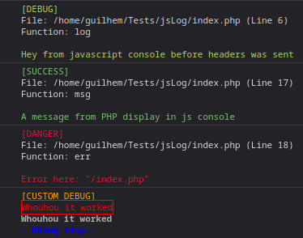

# JsLog
An easy to use php library to show log on js console
Debug php without broking your front

# Start
JsLog is a minimalist library allowing you to put debug message along your code.
1. Import the package in your code:
```php
require('vendor/autoload.php');
use JsLog\JsLog;

// Generate an instance like this
$jslog = JsLog::getInstance();
```

2. Use it
```php
// Use it from the instance
$jslog->log('Your log');

// Or use it without instance
JsLog::getInstance()->msg('Success message !');

// Render error
$jslog->err('Error triggered...');
```
3. Custom renderer

*Jslog* allow you to render your message with css via a custom function:

```php
// Render a custom message, with customm CSS
$jslog->custom(
	"[CUSTOM DEBUG]\n", "color:orange",
	"Whouhou it worked\n", "color:red;border:1px solid red;",
	"Whouhou it worked\n", "color:darkgrey;font-weight:800;",
	"..Debug stop..\n", "color:blue;font-weight:bold"
	);
```

4. See messages

Into your web browser watch the javascript console

5. When debug messages are sent ?

If you pass the True args at the construction
Jslog will send debug only when output buffering have started. Else, message will be put in a FIFO array.
The queue of messages will be flushed at the next call of a log function or at the end of the script.
Else, it will send debug message directly when called

# Examples
Here is the results of the following script:
```php
<?php
require('vendor/autoload.php');
use JsLog\JsLog;

// By adding True jsLog will wait until headers has been sent (relying on ob if activated else `headers_sent` function)
// By default, it is called with none, and will log as soon as called :D
JsLog::getInstance(True)->log('Hey from javascript console before headers was sent');
echo "<!DOCTYPE html><html><head></head><body>";

$jslog = JsLog::getInstance();

$jslog->msg("A message from PHP display in js console");
$jslog->err("Error here: \"" . $_SERVER['SCRIPT_NAME'] . '"');
$jslog->custom(
	"[CUSTOM DEBUG]\n", "color:orange",
	"Whouhou it worked\n", "color:red;border:1px solid red;",
	"Whouhou it worked\n", "color:darkgrey;font-weight:800;",
	"..Debug stop..\n", "color:blue;font-weight:bold"
	);
echo "</body></html>";
```
Inside the javascript console:


